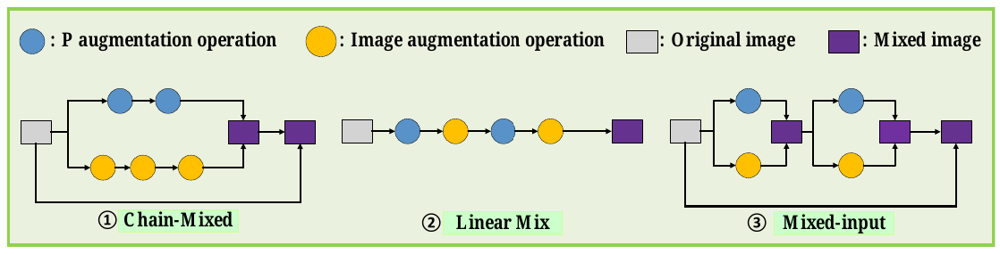

# IPMix writeup

## 1. Background and grounding

### Data augumentation
- Method of applying diverse transformations on clean images to generate new training examples.
- This allows models to resist distribution shifts, resulting in better generalization and improved robustness.
- Typically comes in three types:
    - image-level: Applying transformation on whole image (brightness, sharpness, solarization)
    - patch-level: Mask/replace a portion of the image.
    - pixel-level: Mixing images pixel by pixel

### Previous studies
- for pixel-level or patch-level techniques: most are label variant (techniques that changes/mix training labels when creating new images), which leads to manifold-intrusion (when image is labeled as one class, but is structurally similar to a different class).
- for image-level DA: requires computationally expensive search for optimal DA policy.

## Evaluation metrics

 - **Accuracy**: $ \frac{\text{\# correct preds}} {\text{\# total preds}} $
 - **Robustness**: How well does this model perform on corrupted image set
 - **Calibration**: How well does model stated confidence reflects its actual accuracy
 - **Prediction consistency**: Does model predictions withstand against small image pertubations (which does not change its label)

## 4. IPMix

### Overview

- IPMix is a **label-preserving** DA method.
- Integrates all **three level of DA** (image-level, patch-level, pixel-level) into a single framework.
- Minimal comutational overhead.
- Incoperates **structurally complex synthetic data** to improve image diversity.
- Employs random mixing methods & scar-like image

### Pixel-level & Patch-level

IPMix uses following equation to mix image

$$ \tilde{x} = B \odot x_1 + (I - B) \odot x_2 $$

Where $x_{1}$ is the clean image and $x_{2}$ is unlabeled synthetic image (e.g. fractals, spectrums, contours). This just basically means we are taking linear combination pixel-by-pixel according to weight matrix $B$.

With patch-level DA, we take a region of random size and position in B, set that region to a value $\lambda$ sampled from beta distribution, and set the rest of matrix $B$ to $1$. For pixel-level, the entire image is treated as a patch.

Advantages:
- Very simple, no computation overhead.
- Combines two methods into one framework.
- Label-preserving.

### Image-level

Randomly sample operations from Pillow + randomly sample strength.

### Mixing framework

Author proposed three mixing frameworks (Chain-Mixed, Linear Mix, Mixed Input), which is shown visually in the image above. These frameworks are tested empirically on Error, Robustness & Calibration. **Chain-Mix** ultimately provides the best aggregated results.

In Chain-Mix, we split DA process into two "chains": P-level (Both patch-level & pixel level DA) transformation & Image-level transformation. These creates two separate images, which is then combined in the final step (using another linear combination with $\lambda$ sampled from Dirichlet distribution)

Resulting image is then mix with clean image with $\lambda$ sampled from Beta distribution.

### Random mixing

Instead of only mixing two images linearly (as described in *Pixel-level & Patch-level*), IPMix employs four additional operations

- Addition (summing pixel value from two images)
- Multiplication (multiplying pixel value from two images)
- Random pixel mixing (randomly choosing which pixel to choose from two images)
- Random element mixing (randomly choosing which RGB channel value to choose from two images).

### Scar-like image patches

- During patch-level DA, incorperate both square-ish patches & long, thin rectangular patches (scars).
- Previous research has proven that scar-like sampling is effective for anomaly detection.

